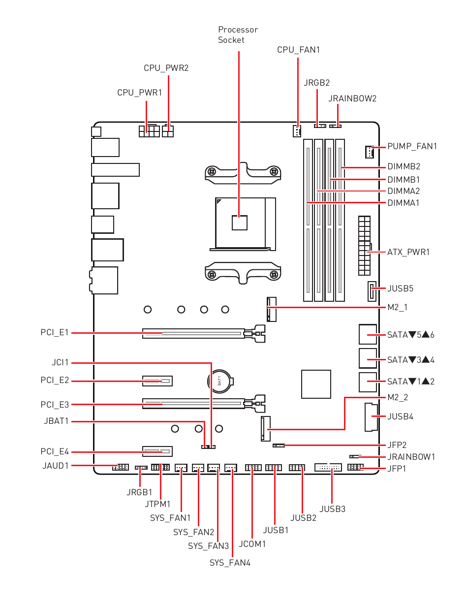
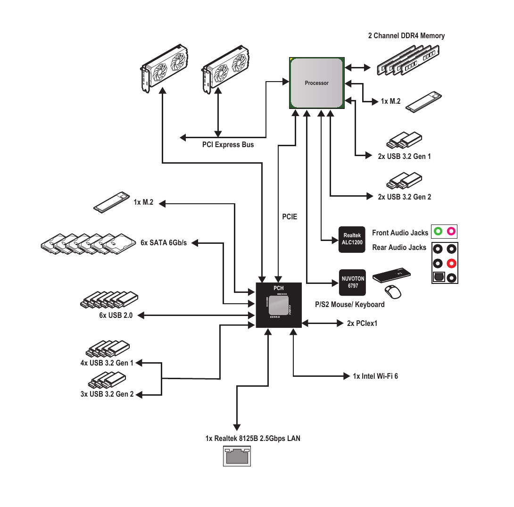

## Lec 1

This is the greatest course, ever.

## Course Structure

Feburary 19th - May 11th
Weeks. In COMP6900 We do metric weeks. That means a week starts on day 1 and ends on day 10. A 'month' has 10 weeks. A semester has 1.5 months.
So that means a semester is exactly 150 days.

Week 1-3

- Asst1, upload to comp6900.github.io/asst1/22s1
- Hardware, Introduction and my Spectro Laptop Design
- Kernel Basics, Paging and Memory Management, Drivers, etc.
- Low level programming with ASM, C and Rust
  - Cross Compilation
- Introduction to Quanta, an OS that just works
- Introduction to Rei, a language that just works on Quanta
  - Pseudocode written in Rei

Week 4-7

- Asst2, upload to comp6900.github.io/asst2/22s1
- Introduction to the Neutron Kernel, the greatest kernel ever
- Implement threading and syscalls in Neutron, ASST2 Pt.1
- Why are modern kernels so bad?

Week 8-12

- Asst3, upload to comp6900.github.io/asst3/22s1
- Implement processes and ELF loader in Neutron, ASST3 Pt.1
- Implement userspace and graphics, ASST3 Pt.2

Week 13-15

- Finals week
- Tests knowledge on kernels, OS architecture, hardware in multiple choice and short answer questions in `rei`
- Revision material uploaded to comp6900.github.io/lectures/revision-22s1.html
- Final exam, done completely online in comp6900.github.io/final/22s1

### Expected Course Marks


## FAQ

Is this legit?

- Yes

Is the info good?

- As real as it gets

Does this count towards something?

- I'll give you a certificate if you pass, made by me of course
- To pass you have to show you know what you're doing. The course is mostly assessment based with a 35% final exam

Are there video lectures?

- Of course. Uploaded to [youtube](https://www.youtube.com/channel/UC6qO4W9BRAPpUOUD43aDDvA). Or alternatively in the Videos section which embeds the videos with a custom HTML5 player

## What is COMP6900?

It is the first fully automated course. You dont need any old dude talking in a monotone voice for 2 hours. Just read, watch and do.

## Middleman Analogy

Like a middleman, a kernel sits at a stand for any requests. When someone has a request, they go up to the middleman and asks for something. The middleman then sifts through their documents to find something that can satisfy their request. If it cant find an appropriate thing, then it will have to talk to other middleman on a lower level than it. And wait for them to reply back. And if they dont have it, they will have to talk to even lower middlemen.

So this is basically the bane of the kernel. Sit and wait until someone (an app) needs something (service). Then try to best fulfill it (daemons, drivers). If request is valid and can be done, then its only a matter of time. If it cant, then the asker must ask again at a later time or ask something else. The middleman (kernel) doesnt like being held by bad requests and time (IO) so it tries its best to mitigate it (timetable hueristics, clock algorithm, etc). A middleman wont be successful if he doesnt get any requests would he? So the busier he is, the better job he is doing (more CPU/resource utilisation). A middleman also has to protect his informats and the information itself so he doesnt get a bad rep. You dont want a middleman giving out info that could jeoprodise someone would you? So you ensure the buyer is reputable (paging, permissions) and the info itself is reputable (headers in tact, journalling, corrupt bits).

## Government Analogy

An OS is like a government in that it is useless by itself. When a flood occurs and the entirety of Sydney goes underwater, who do you call? The federal government, who has to provide funding and support to the state government, who then uses that for their emergency services.

An OS has a similar modus operandi. An interrupt request is generated by a hardware device. This causes the kernel code to run and intercept that interrupt, taking over from normal user code. Then each level of the hierarchy packages the response until it is served back to the user.

## RISCV64GC

In the risc world we deal with concepts like:

- RISC pipeline (vs "hyperthreading")
- ALU Load/Store instructions (vs Register-Memory)
- Extensions, for floats, atomics, hypervisor (virtualisation), etc.

### What the hell is RISCV64GC?

The answer is RV64IMAFDZicsrZifenceiC

- 64I: 64-bit integer extensions
- M: Multiplication
- A: Atomics
- F: Floating Point (32-bit)
- D: Floating Point (64-bit)
- Zicsr: Control & Status
- Zfencei: Extra Memory Fence/Protection
- C: Compressed Instructions (16-bit)

### Wait what is RISCV?

- An open source ISA.
- Much better than x86, objectively. I said so.
- Upside: Simple, elegant, modular, extensible.
- Upside: Less electricity goes into decoding the instructions (x86), so less power usage, though maybe more compiler work
- Upside: Easier assembly. Dont have to remember a billion different instructions and 2 different syntaxes. In fact you can use the assembly syntax I made [To be uploaded soon].
- Downside: More careful about cache since x86 programs tend to be smaller in size and can fit on CPU cache.

## RISC-V Instruction Types

The people at sifive seemed to realise the potential of hardware efficiency gains. So they came up with 6 different ways to encode a 32-bit riscv instruction.

### R Format

For arithmetic operations like `add`. Stuff that can be done in the ALU/FPU. <br/>

`<instruction> <dest_reg> <src_reg1> <src_reg2>`

32-bit Instruction: <br/>
[ func 7 | src_reg2 5 | src_reg1 5 | func 3 | dest_reg 5 | opcode 7 ]

### I Format

For arithmetic operations with an immediate like `addi`. Also loading to an ALU register from memory

32-bit Instruction: <br/>
[ immediate_val 12 | src_reg 5 | func 3 | dest_reg 5 | opcode 7 ]

### S Format

Store operations from register to memory, stuff like `sw`.

- In RISC world, must load (I) a val from memory to a register, then apply arithmetic ops (R/I), then store the val back (S)

32-bit Instruction: <br/>
[ immediate_val[11..5] 7 | src_reg2 5 | src_reg1 5 | func 3 | immediate_val[4..0] 5 | opcode 7 ]

### SB Format

Branch to another address, updates the PC directly by specifying an offset instead of incrementing. Stuff like `beq`

TYPE 1: \
[ immediate_val[12..5] 7 | src_reg2 5 | src_reg1 5 | func 3 | immediate_val[4..1] 5 | opcode 7 ]

TYPE 2: \
[ immediate_val[10..5] 7 | src_reg2 5 | src_reg1 5 | func 3 | immediate_val[4..11] 5 | opcode 7 ]

### U Format

Arithmetic ops with upper immediates like `lui`

- In riscv, upper immediates are always 20bits, unlike *that* other arch

32-bit Instruction: \
[ immediate_val[31:12] 20 | dest_reg 5 | opcode 7 ]

### UJ Format

Jump to another address. Different to branch since you directly specify an address/offset rather than a relative offset. Also `link`. So `jal`

32-bit Instruction: \
[ immediate_val[31:12] 20 | dest_reg 5 | opcode 7 ]

- so `jal` stores the return address in `dest_reg` unlike branch
- Theres like at least 2 different types of instruction types for jal and jalr cause why not I guess

Do you have to remember these? No. But you will have to implement it and `autotest-6900` has to work so yea.

## Hardware: My Motherboard

I have an MSI Tomahawk X570, it is quite good.

### Overview



- As you can see, the X570 board is quite cool. It is fully featured with ports for fans, pci, usb, sata and RGB controllers.
- The most important parts are the chipset, DIMM slots, PCIe x16/x4, power ports, USB ports.

### Block Diagram



- Note Wifi is included as well. In the current day, wifi is just too good to skip. In COMP6900, we will be talking quite a bit about networking and wireless technologies. I dont exactly want to end up like [linux](../dumbstuff/monolithic.md)

## Hardware: Chipset

The chipset is the heart of the board. It is a set of components that manages the flow of data between the CPU, memory and other components on the board.

- On the X570 Tomahawk, it is that 'Processor Socket' thing and the BIOS firmware that controls BIOS IO.
- On the Spectro Laptop, we use an SoC (socket on chip) that includes the cpu, gpu and unified ram. The BIOS firmware is simply the ROM.

## Hardware: CPU

The most important thing on your PC. Without it, good luck!

- Synchronises other components
- On boot, loads BIOS firmware into RAM and runs it. When you see a screen like "MSI press f7 to enter bios", that is the firmware running on the CPU in machine mode (ring 3)
- All the things that we code runs on the CPU. The higher level stuff usually runs in ring 0. The lower level stuff runs in ring 1-3. The kernel for example should run in ring 1 (supervisor mode).

## Hardware: RAM

RAM is great and in COMP6900 we will be talking a lot about memory in general
RAM usually means SDRAM and in the current time, DDR4/5 with CL15-19 speeds

- If there is a dedicated GPU, it would have its own RAM called 'VRAM'. The Spectro SoC does not use separate memory however, rather something called 'unified memory'

## Hardware: PCIe

PCIe stands for 'Peripheral Component Interface express'

- You can think of it as 'really fast io'
- Normally used for GPUs, SSDS (nvme), Network cards

## Hardware: GPU

Technically you could do everything on the CPU. Render calls as well. But it would be very slow when you start to render more complex things. So instead we offload complex render ops to a component built to crunch numbers together and output a frame as fast as possible

- Like the CPU, the GPU can run any program for its ISA. A GPU program is called a shader and is compiled to binary code and is DMA'd to GPU Memory. Then a software driver can make a call to the GPU to tell it to start executing the code and output it to an MMIO framebuffer or directly out to video.

## Hardware: Disk

In COMP6900 we dont care about floppy disks or HDDs. We only talk about flash memory. Usually NAND.

- USB sticks and NVMe SSDs

### NVMe

Non Volatile Memory express, an interface that uses PCIe lanes to transmit data.

- The Spectro Laptop comes with 500.0 GB of NVMe 1.4 builtin storage. In COMP6900 we can assume infinite disk space and 16GB of unified memory or RAM.

## BIOS: What don't we need?

We keep talking about what we *do* need, and end up with a mess known as linux. So in COMP6900 we also talk a lot about what we *shouldn't* need.

- For a BIOS firmware, we prob dont need hardware temperature details, RGB controls (can be placed in userspace), RAID config, OC, Flashing capability, Virtualisation options.
- The above can mostly be implemented in userspace as an app that uses BIOS functions.

## Rei: Language of Systems

Rei is a language that Im making to demonstrate how code works in a simplistic manner. Here is a chunk of rei code:

```scala
fn f() = {
    println("Hi!")
}

class C {
    let var: Int

    # all class level functions are object methods by default
    fn get_var() = {}

    # class methods require an annotation
    @class
    fn do_something() = {}
}

# traits are like classes, but do not have state and must be implemented
trait D {
    fn k()
}

class G {
    @impl D
    fn k() {
        println("G's implementation of D!")
    }

    # all fields must have an explicit type
    let _k: String
    # class field rather than object field
    let _d: static Int
    # field with a default value
    let _g: Int = 3

    # a function with the constructor annotation must initialise all fields, except the static ones
    # constructor functions are classmethods and must be referenced with G::new() rather than g.k()
    @constructor
    fn new() {
        # if left blank, uses the default constructors of _k and _d
    }
}

# In rei::std library
class String {
    # ref keyword -> reference to a str type
    _str: ref str

    # a class function 'new' with the constructor annotation allows the class to be constructed like so: 
    # let x: String = String() or let x = String()
    @constructor
    fn new(_str: &str) {
        # fields are referenced by 'this' keyword
        this._str = _str
    }

    # methods may be overloaded, the constructor for example can be overloaded
    @constructor
    fn new(_int: Int) {}
}

```

### Ideas

- No unitialised declaration for instantiable variables, any declaration is a definition that uses the default constructors of all fields. Does not include trait methods
- NO SEMICOLONS OR ANY OTHER JUNK SYNTAX STUFF
- Builtin OOP and Functional paradigms. Recommended to use OOP whenever possible and return `self` as a reference
- NO WEIRD, BAD, MESSY STUFF. Stuff like C++ where you have 30 lines of template code and C headers where you have:
<br/>

```c
extern a;
extern __A;
extern b;
extern __B;
extern c;
extern __C;
...

typedef X __x
typedef Y __y

...

#define DO do(__x, __y)
#define DO_X __do_x(x, y)
```

- Philosophy 1: No junk headers filled with externable variables and half assed declarations.
- Philosophy 2: Modular and structured code with the `package` keyword and more complex directory hierarchies rather than a single file that contains everything.
- Philosophy 3: Simple, readable syntax that makes sense right away and doesnt need 50 lines of comments before a function to state what it is trying to do. Utilise the `std` library where possible instead of your own 10-minute hacky solutions.
- Philosophy 4: No 'extra' functionality like how c++ tries to implement everything that exists. Higher level functionality is built on core functionality instead of being a language feature. That means, no coroutines, no template restrictions, complex typedefs, etc. Focus more on doing what you can do already like composition with simple things.
- Philosophy 5: Builtin and good multithreading. Stuff like async await and the way go handles it. No `thread::spawn()` semantics

## Quanta

What is quanta you may ask?

- Quanta is something built to just work
- I will talk about it more later. But for now I am typing this on a windows machine which freezes like at least once per day so

## How do Assignments Work?

Check the assignments page for full details. I'll post a repo called `asst-1` to the github which you need to download yourself and complete the exercises. You can run `autotest-6900` to ensure your solution is correct. The way most of the assignments are structured is through internal testing through unit tests. A bunch of tests will be run on your code in a specific module/function and they should all pass.

## How does the Final Exam work?

Similar to assignments with `autotest-6900` but with a time limit. Multiple choice and short answer questions will be done on this site.

## How do I pass?

Dont be a collectivist.
